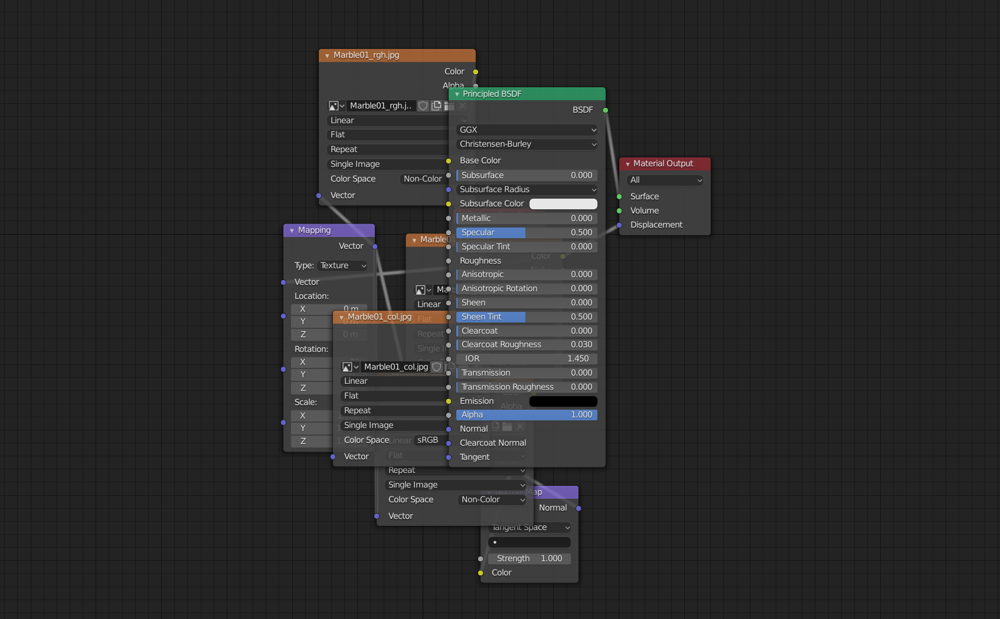
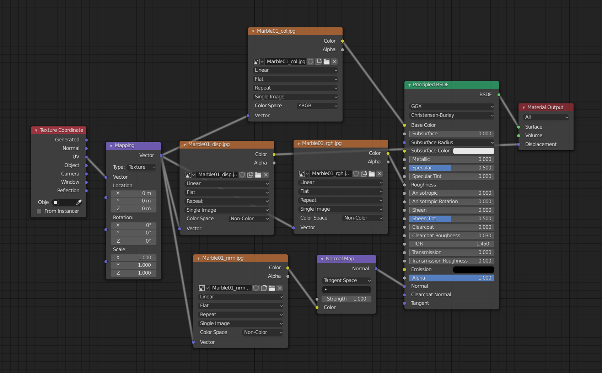
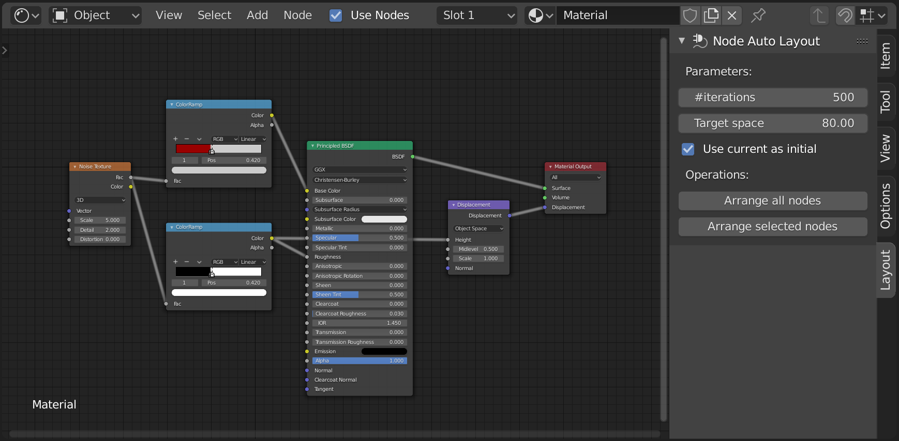

# nodelayout


A Blender add-on for automatic layout of nodes.

## Example

Before:


After:


## Goals

### As an Blender Add-On

This repository can be used as a Blender add-on. It provides `Node Auto Layout` panel UI for the node editor.



### As a Python Library

This repository can be used as a Python library for developing other Blender add-ons and scripts. It provides the following function to perform the auto-layout.
```python
def arrange_nodes(node_tree: bpy.types.NodeTree,
                  use_current_layout_as_initial_guess: bool = False,
                  max_num_iters: int = 1000,
                  target_space: float = 50.0,
                  fix_horizontal_location: bool = True,
                  fix_vertical_location: bool = True,
                  fix_overlaps: bool = True,
                  verbose: bool = False) -> None:
    ...
```

## Blender Versions

`2.80` or later. Tested on `2.80` and `2.81`.

## TODOs

- Improve controllability of the panel UI
- Add support of layout frames
- Add support of arranging only selected nodes
- Create documentation
